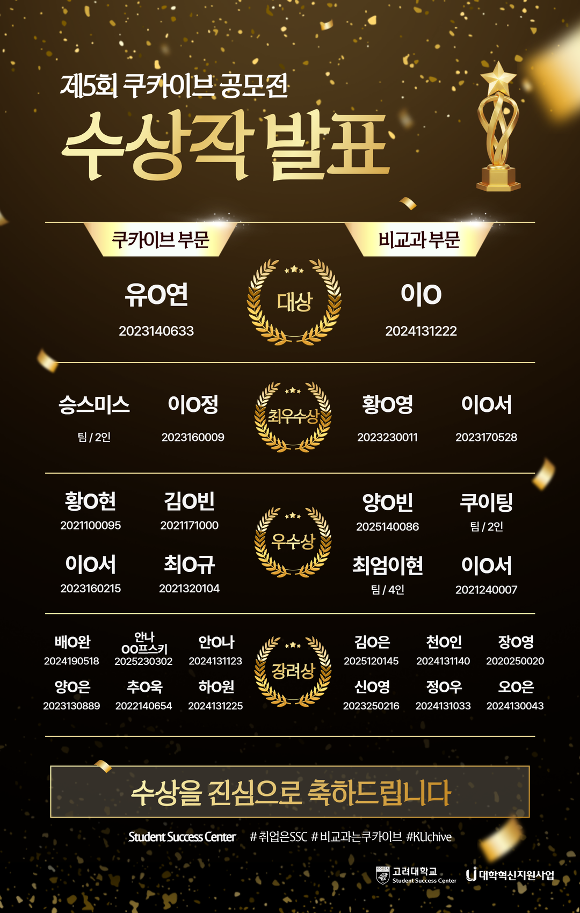

# KUchive 자동화 프로젝트

https://gossamer-taker-cfa.notion.site/KUchive-2e1e9ba202158048ae71c8dec7425edf

## 개요

KUchive는 고려대학교 비교과 프로그램 플랫폼을 보다 효율적으로 활용하기 위해 제작한 자동화 기반 정보 관리 프로젝트이다.

기존 쿠카이브 시스템은 사용자가 직접 웹사이트에 접속해 수시로 확인해야 하며, 인기 프로그램의 경우 조기 마감으로 인해 정보를 놓치기 쉽다는 문제가 있었다. 또한 프로그램 정보가 분산되어 있어 전체 일정과 마감 현황을 한눈에 파악하기 어려웠다.

본 프로젝트는 이러한 수동 모니터링 비용과 정보 가독성 문제를 해결하는 것을 목표

---

## 진행 방식 및 구현 구조

본 시스템은 별도의 프론트엔드 개발 없이, 자동화와 API 연동을 중심으로 구성

### 1. 데이터 수집
- 쿠카이브 공식 홈페이지에서 비교과 프로그램 정보를 주기적으로 수집
- 프로그램명, 신청 기간, 주관 부서, 고유 식별자 등의 핵심 정보 추출

### 2. Notion 연동
- Notion API를 활용해 수집된 데이터를 데이터베이스 형태로 동기화
- 프로그램 고유 식별자를 기준으로 중복 등록 방지

### 3. 상태 자동 관리
- 신청 마감일을 기준으로 프로그램 상태 자동 갱신
- D-day 기준으로 ‘마감 임박’ 등 태그를 자동 부여

### 4. 알림 시스템
- Slack API를 연동해 신규 프로그램 등록 및 마감 임박 시 실시간 알림 전송
- 사용자가 매일 사이트를 직접 확인해야 하는 구조 제거

### 5. 일정 시각화
- Notion 캘린더 뷰를 활용해 전체 비교과 일정을 한눈에 확인 가능하도록 구성

본 구조는 유지보수 부담을 최소화하면서도 실제 사용성을 높이는 방향으로 설계되었다.

---

## 수상 내역

🏆 **제5회 쿠카이브 공모전 – 우수상**

---

## 사용 언어 및 Tool

- Python (웹 크롤링 및 자동화 로직)
- Notion API
- Slack API
- GitHub Actions (주기적 실행)

---
